# Dokumentasi Sistem LunaPOS — Point of Sale & Inventory

> Versi dokumentasi: 1.0 | Tanggal: 2026-08-05
> Sumber: analisis menyeluruh terhadap source code (backend, frontend, database) dan file pendukung project.

---

## Daftar Isi

1. [Ringkasan Sistem](#1-ringkasan-sistem)
2. [Arsitektur Sistem](#2-arsitektur-sistem)
3. [Teknologi yang Digunakan](#3-teknologi-yang-digunakan)
4. [Struktur Project](#4-struktur-project)
5. [Alur Bisnis](#5-alur-bisnis)
6. [Modul Sistem](#6-modul-sistem)
7. [Analisis UI](#7-analisis-ui)
8. [Detail Komponen](#8-detail-komponen)
9. [Hak Akses](#9-hak-akses)
10. [Database](#10-database)
11. [API Documentation](#11-api-documentation)
12. [Business Rules](#12-business-rules)
13. [Validasi](#13-validasi)
14. [Error Handling](#14-error-handling)
15. [Security](#15-security)
16. [Performance](#16-performance)
17. [Kelebihan Sistem](#17-kelebihan-sistem)
18. [Kekurangan Sistem](#18-kekurangan-sistem)
19. [Rekomendasi Improvement](#19-rekomendasi-improvement)
20. [Dokumentasi Source Code](#20-dokumentasi-source-code)
21. [Dependency](#21-dependency)
22. [Alur Request](#22-alur-request)
23. [Sequence Diagram](#23-sequence-diagram)
24. [Activity Diagram](#24-activity-diagram)
25. [Use Case Diagram](#25-use-case-diagram)
26. [Class Diagram](#26-class-diagram)
27. [Kesimpulan](#27-kesimpulan)

---

## 1. Ringkasan Sistem

| Aspek | Deskripsi |
|---|---|
| **Nama aplikasi** | LunaPOS |
| **Jenis** | Point of Sale (POS) + Inventory Management System |
| **Tujuan** | Mengelola transaksi penjualan (kasir), pembelian, stok, kas, promo, hutang/piutang, dan laporan pada usaha multi-cabang dalam satu platform terpadu |
| **Deskripsi** | "LunaPOS - POS & Inventory (React + Express + MySQL)" — aplikasi modern multi-cabang yang berjalan di Laragon (Windows) |
| **Permasalahan yang diselesaikan** | 1) Kasir lambat dan manual; 2) Stok antar cabang tidak sinkron; 3) Promo (BOGO) sulit dihitung manual; 4) Hutang/piutang tidak tercatat rapi; 5) Laporan penjualan sulit disusun; 6) Selisih kas shift tidak terdeteksi |
| **Target pengguna** | Pemilik usaha ritel, Super Admin, Admin Pusat, Manager Cabang, Kasir, dan staf Gudang |
| **Gambaran umum** | SPA React dengan sidebar berbasis permission, REST API Express, dan database MySQL (31 tabel). Sistem mencatat seluruh mutasi stok (stock_movements) sebagai jejak audit, menghitung promo otomatis saat checkout, dan menyediakan laporan harian/bulanan/tahunan dengan export CSV. |

> **Asumsi:** Target pengguna utama adalah usaha ritel menengah (toko, minimarket, distributor) dengan 1 pusat + beberapa cabang. Versi web ini adalah admin panel; pembacaan barcode kamera pada halaman POS menargetkan perangkat dengan kamera.

---

## 2. Arsitektur Sistem

### 2.1 Arsitektur Aplikasi

Arsitektur **client-server** dengan pola **SPA + REST API + RDBMS**, dipisah menjadi dua aplikasi independen yang berkomunikasi via HTTP/JSON.

### 2.2 Komponen

| Lapisan | Komponen | Keterangan |
|---|---|---|
| Frontend | React SPA (Vite) | Port 5173, proxy `/api` dan `/uploads` ke backend |
| Backend | Express REST API | Port 5000, pola Controller → Service → DB Pool |
| Database | MySQL 8 (InnoDB) | 31 tabel, relasi lengkap dengan foreign key |
| Storage file | `backend/uploads/` | Foto produk, di-serve statis via `/uploads` |
| Integrasi eksternal | Tidak ada integrasi SaaS/pihak ketiga | Scanner barcode kamera memakai library client-side (`html5-qrcode`), bukan API eksternal |

### 2.3 Alur Komunikasi Antar Komponen

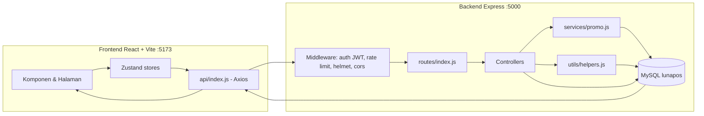

---

## 3. Teknologi yang Digunakan

### 3.1 Tabel Teknologi

| Kategori | Teknologi | Fungsi |
|---|---|---|
| Frontend Framework | React 18 | Membangun UI berbasis komponen |
| Build Tool | Vite 5 | Dev server, bundling, hot reload |
| Bahasa (frontend) | JavaScript (ESM, JSX) | Bahasa utama frontend |
| CSS Framework | Tailwind CSS 3 | Styling utility-first dengan mode gelap |
| State Management | Zustand 4 | Store global: auth, pos (keranjang), ui (dark mode/sidebar) |
| Routing | React Router 6 | Navigasi SPA + route protection |
| Form & Validasi | React Hook Form + Zod | Form dengan validasi schema |
| Tabel | TanStack Table 8 | DataTable generik dengan pagination |
| Chart | Recharts 2 | Grafik dashboard & laporan |
| Ikon | lucide-react | Ikon UI |
| Barcode | react-barcode (cetak), html5-qrcode (scan kamera) | Cetak & scan barcode |
| Notifikasi | SweetAlert2 | Toast & dialog konfirmasi |
| HTTP Client | Axios | Request API dengan interceptor token |
| Backend Framework | Express 4 | REST API |
| Bahasa (backend) | Node.js (CommonJS) | Runtime backend |
| Database | MySQL 8 (mysql2/promise) | Penyimpanan data utama |
| ORM / Query | Raw SQL (parameterized queries) | Semua query memakai prepared statements |
| Auth | JWT (jsonwebtoken) + bcryptjs | Token auth + hash password |
| Security | Helmet, CORS, express-rate-limit | Header security, CORS, rate limiting |
| Validasi Backend | Zod 3 | Validasi schema request |
| Upload | Multer | Upload foto produk (max 2MB, JPG/PNG/WEBP) |
| Logging | Morgan | Log request API |
| Compression | compression | Gzip response |
| Env Config | dotenv | Variabel lingkungan |
| Package Manager | npm | Manajemen dependency |
| Orkestrasi dev | concurrently | Menjalankan backend + frontend bersamaan |
| Dev Server Backend | nodemon | Auto-restart backend saat file berubah |

---

## 4. Struktur Project

```
lunapos/
├── package.json              # Root: script dev gabungan (backend + frontend)
├── README.md                 # Panduan instalasi & fitur
├── database/
│   ├── schema.sql            # Skema MySQL lengkap (31 tabel + relasi + index)
│   └── seed.sql              # Seed master data (produk, satuan, promo, cabang)
├── backend/
│   ├── package.json
│   ├── scripts/
│   │   ├── init-db.js        # Inisialisasi DB + user demo (password di-hash)
│   │   └── smoke-test.js     # Tes API end-to-end (login, POS + promo, hutang, hold, kartu stok, laporan)
│   ├── uploads/              # Folder file upload (foto produk)
│   └── src/
│       ├── index.js          # Entry point Express (middleware global, route, error handler)
│       ├── config/db.js      # Pool koneksi MySQL
│       ├── controllers/      # 14 controller bisnis
│       ├── middleware/       # auth (JWT+permission), errorHandler, upload (multer)
│       ├── routes/index.js   # Registrasi seluruh endpoint REST
│       ├── services/promo.js # Engine promo BOGO & diskon %
│       └── utils/helpers.js  # Response helper, pagination, generateNo, audit, mutasi stok
└── frontend/
    ├── package.json
    ├── vite.config.js        # Proxy /api dan /uploads ke localhost:5000
    ├── tailwind.config.js
    ├── index.html
    └── src/
        ├── main.jsx / App.jsx / index.css
        ├── api/              # Axios client + seluruh endpoint API
        ├── components/       # DataTable, Field, Header, Layout, Modal, PageHeader, ProtectedRoute, Sidebar, Skeleton, StatCard
        ├── pages/            # 19 halaman
        ├── stores/           # auth.js, pos.js, ui.js
        └── utils/            # confirm.js (SweetAlert2), format.js (rupiah/CSV/tanggal), toast.js
```

### Fungsi Folder Penting

| Folder | Fungsi |
|---|---|
| `backend/src/controllers/` | Logika bisnis per modul (auth, sales, purchases, stock, cash, dll) |
| `backend/src/middleware/` | Auth JWT + permission check, error handler global, upload multer |
| `backend/src/routes/` | Definisi endpoint dan pemetaan ke controller |
| `backend/src/services/` | Engine promo (BOGO + diskon %) yang dipakai controller sales |
| `backend/src/utils/` | Helper: format response, pagination, generate nomor dokumen, audit log, mutasi stok atomik |
| `backend/src/config/` | Konfigurasi koneksi database (pool) |
| `database/` | Skema DDL dan data seed |
| `frontend/src/pages/` | Halaman-halaman aplikasi (POS, Dashboard, Laporan, dll) |
| `frontend/src/components/` | Komponen UI reusable |
| `frontend/src/stores/` | State global Zustand (auth, ui, pos) |
| `frontend/src/api/` | Layer akses API (axios + interceptor token) |
| `frontend/src/utils/` | Utilitas format (rupiah, tanggal, CSV), toast, konfirmasi |

---

## 5. Alur Bisnis

### 5.1 Login

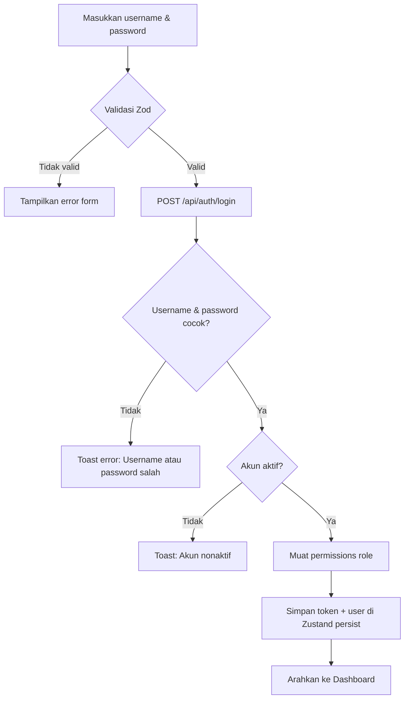

### 5.2 Transaksi POS (Kasir)

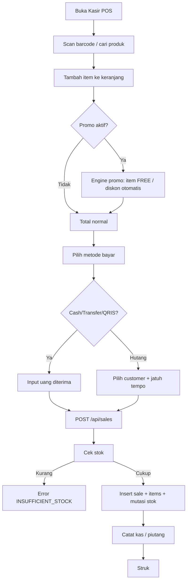

### 5.3 Hold & Recall

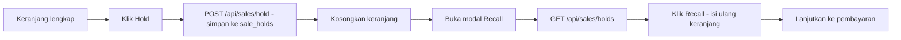

### 5.4 Mutasi Stok Antar Cabang (Approval)

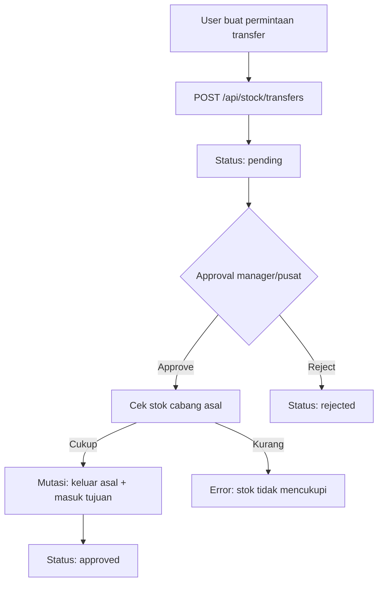

### 5.5 Stok Opname

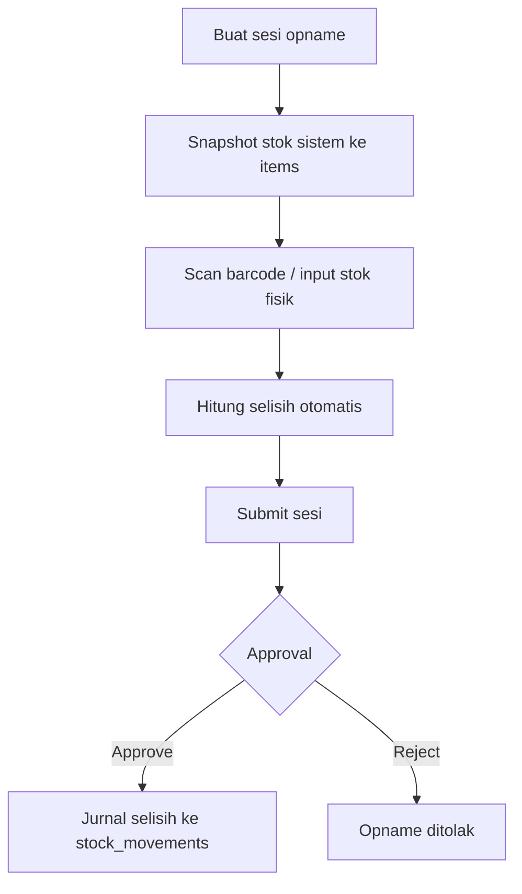

### 5.6 Kas & Shift Kasir

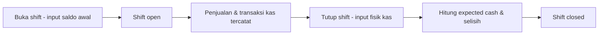

### 5.7 Pembayaran Hutang / Piutang

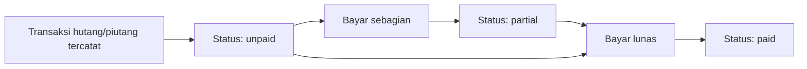

---

## 6. Modul Sistem

| Modul | Tujuan | Fitur | Halaman | API | Tabel DB |
|---|---|---|---|---|---|
| **Auth** | Autentikasi pengguna | Login, refresh token, profil, ganti password, reset password | Login, Profile | `POST /auth/login`, `POST /auth/refresh`, `GET /auth/me`, `POST /auth/change-password`, `POST /auth/reset-password` | `users`, `roles`, `permissions` |
| **Dashboard** | Ringkasan performa bisnis | StatCard omzet/laba/transaksi, grafik 7 hari & 12 bulan, top 10 produk, top 5 cabang | Dashboard | `GET /reports/dashboard` | `sales`, `sale_items`, `products`, `receivables`, `debts`, `product_stocks` |
| **POS / Penjualan** | Transaksi kasir | Scan barcode (keyboard & kamera), cari realtime, qty cepat, edit harga (per hak akses), diskon item/transaksi, metode bayar cash/transfer/QRIS/hutang/mixed, hold & recall, void, struk, **pilih variasi produk** (ukuran/warna) | POS, Riwayat Penjualan | `POST /sales`, `GET /sales`, `GET /sales/:id`, `POST /sales/:id/void`, `POST /sales/hold`, `GET /sales/holds`, `POST /sales/receivables/:id/pay` | `sales`, `sale_items`, `sale_holds`, `receivables`, `receivable_payments` |
| **Produk** | Master barang | Kode otomatis, barcode EAN-13/CODE128, foto, satuan bertingkat (pcs/lusin/dus) dengan konversi, 4 harga (beli/retail/grosir/member), stok minimum, adjust stok, **variasi produk** (nama/SKU/barcode/selisih harga/aktif), **flag batch/expired** | Barang | `GET/POST/PUT/DELETE /products`, `GET /products/options`, `POST /products/generate-barcode`, `POST /products/:id/adjust-stock` | `products`, `product_units`, `product_stocks`, `product_variants`, `categories`, `brands`, `units` |
| **Master Data** | Data referensi | CRUD kategori, merk, satuan | Kategori / Merk / Satuan | `/categories`, `/brands`, `/units` (+ `/options`) | `categories`, `brands`, `units` |
| **Supplier** | Master pemasok + hutang | CRUD supplier, lihat hutang & riwayat pembelian per supplier | Supplier | `GET/POST/PUT/DELETE /suppliers`, `GET /suppliers/:id/debts`, `GET /suppliers/:id/purchases` | `suppliers`, `debts`, `purchases` |
| **Customer** | Master pelanggan + piutang | CRUD customer (umum/grosir/member), lihat piutang & riwayat penjualan | Customer | `GET/POST/PUT/DELETE /customers`, `GET /customers/:id/receivables`, `GET /customers/:id/sales` | `customers`, `receivables`, `sales` |
| **Cabang** | Kelola cabang | CRUD cabang, status aktif | Cabang | `GET/POST/PUT/DELETE /branches` | `branches` |
| **User & Hak Akses** | Kelola pengguna | CRUD user, kelola role & permission per menu (view/create/edit/delete) | User & Hak Akses | `GET/POST/PUT/DELETE /users`, `GET /users/roles`, `GET/PUT /users/:id/permissions` | `users`, `roles`, `permissions` |
| **Pembelian & Retur** | Pengadaan barang | Pembelian cash/hutang, diskon, pajak, ongkir, retur sebagian/penuh, **input batch & tanggal kadaluarsa per item** | Pembelian & Retur | `POST /purchases`, `GET /purchases`, `GET /purchases/:id`, `POST /purchases/returns`, `GET /purchases/returns` | `purchases`, `purchase_items`, `purchase_returns`, `purchase_return_items`, `debts`, `product_batches` |
| **Stok** | Pengelolaan stok | Kartu stok saldo berjalan, mutasi stok, stok menipis, **tab Batch/Expired** (filter aktif/akan kadaluarsa/sudah kadaluarsa, input batch manual, FEFO saat penjualan) | Stok & Kartu Stok | `GET /stock/movements`, `GET /stock/card`, `GET /stock/low`, `GET /batches`, `GET /batches/summary`, `POST /batches`, `PUT /batches/:id` | `stock_movements`, `product_stocks`, `products`, `product_batches` |
| **Mutasi Antar Cabang** | Distribusi stok | Transfer antar cabang dengan approval | Mutasi Antar Cabang | `POST /stock/transfers`, `GET /stock/transfers`, `POST /stock/transfers/:id/approve`, `POST /stock/transfers/:id/reject` | `stock_transfers`, `stock_transfer_items` |
| **Stok Opname** | Audit fisik stok | Sesi opname, scan barcode, input fisik, selisih, approval, jurnal | Stok Opname | `POST/GET /stock/opnames`, `GET /stock/opnames/:id`, `POST /stock/opnames/:id/items`, `PUT /stock/opnames/:id/items/:itemId`, `POST /stock/opnames/:id/submit|approve|reject` | `stock_opnames`, `stock_opname_items` |
| **Kas & Shift** | Pengelolaan kas harian | Buka/tutup shift, saldo awal, kas masuk/keluar, setor pusat, tarik tunai, selisih shift | Kas & Shift | `POST /cash/shifts/open`, `POST /cash/shifts/:id/close`, `GET /cash/shifts`, `POST/GET /cash/transactions` | `shifts`, `cash_transactions` |
| **Promo** | Kampanye penjualan | BOGO (Beli X Gratis Y) & diskon %, per produk/kategori/semua, per cabang/periode | Promo | `GET/POST/PUT/DELETE /promotions` | `promotions`, `promo_items` |
| **Laporan** | Analisis bisnis | Laporan penjualan/pembelian/kas/stok/hutang-piutang/bulanan, breakdown per kasir/cabang/barang/kategori/customer, **export CSV/Excel/PDF + invoice PDF** | Laporan | `GET /reports/sales`, `GET /reports/purchases`, `GET /reports/cash`, `GET /reports/stock`, `GET /reports/debts`, `GET /reports/monthly`, `GET /export/report`, `GET /export/invoice/:saleId` | `sales`, `sale_items`, `purchases`, `cash_transactions`, `product_stocks`, `debts`, `receivables` |
| **PWA & Offline** | Akses tanpa internet | Installable (manifest + service worker), cache API & aset, **mode offline**: transaksi POS masuk antrian lokal & sinkron otomatis saat online, badge status | Semua halaman | (client-side) `virtual:pwa-register`, `src/utils/offline.js` | `localStorage` (`lunapos-queue`) |
| **Backup Database** | Cadangkan & pulihkan data | Buat backup SQL (mysqldump) sekali klik, unduh, hapus, **restore** (khusus Super Admin), info ukuran/jumlah tabel | Backup Database | `GET /backup/files`, `GET /backup/info`, `POST /backup`, `GET /backup/download/:filename`, `POST /backup/restore`, `DELETE /backup/:filename` | (file `.sql` di `backend/backups/`) |
| **Barcode** | Cetak label produk | Pilih produk → jumlah label → ukuran label → preview → cetak massal | Cetak Barcode | `GET /barcode/labels`, `GET /barcode/scan/:code` | `products`, `product_units` |

### Hak Akses per Modul (ringkasan)

| Modul | Super Admin | Admin Pusat | Manager Cabang | Kasir | Gudang |
|---|---|---|---|---|---|
| Dashboard | Lihat | Lihat | Lihat | Lihat | Lihat |
| Produk | Full | Full | CRUD (tanpa hapus) | Lihat | CRUD (tanpa hapus) |
| Master (kat/merk/unit) | Full | Full | CRUD (tanpa hapus) | Tidak | CRUD (tanpa hapus) |
| Supplier | Full | Full | CRUD (tanpa hapus) | Tidak | CRUD (tanpa hapus) |
| Customer | Full | Full | CRUD (tanpa hapus) | Lihat + Tambah | Tidak |
| Cabang | Full | Full | Lihat | Tidak | Tidak |
| User | Full | Full | Lihat | Tidak | Tidak |
| Penjualan | Full | Full | Full (termasuk void) | Lihat + Tambah | Lihat |
| Pembelian | Full | Full | CRUD (tanpa hapus) | Tidak | Tambah |
| Retur | Full | Full | CRUD (tanpa hapus) | Tidak | Full |
| Transfer | Full | Full | CRUD (tanpa hapus) | Tidak | CRUD (tanpa hapus) |
| Opname | Full | Full | CRUD (tanpa hapus) | Tidak | CRUD (tanpa hapus) |
| Stok | Full | Full | Lihat + Edit | Lihat | Full |
| Kas | Full | Full | CRUD (tanpa hapus) | Tambah | Tidak |
| Shift | Full | Full | CRUD (tanpa hapus) | CRUD (tanpa hapus) | Tidak |
| Promo | Full | Full | Lihat | Tidak | Tidak |
| Laporan | Lihat | Lihat | Lihat | Lihat | Lihat |
| Barcode | Full | Full | Full | Tidak | Full |
| Backup DB | Full | Full | Lihat | Tidak | Tidak |

---

## 7. Analisis UI

| Halaman | Fungsi | Komponen utama | Form | Button | Modal | Filter | Tabel | Chart | Badge/Status |
|---|---|---|---|---|---|---|---|---|---|
| **Login** | Autentikasi | Split panel branding + form | Username, password (toggle tampil) | Masuk | - | - | - | - | Badge fitur |
| **Dashboard** | Ringkasan bisnis | StatCard, chart, daftar top produk | - | Buka Kasir, Laporan | - | - | Daftar top 10 produk, top 5 cabang | Line 7 hari, Bar 12 bulan | Badge peringkat produk |
| **POS** | Transaksi kasir | Keranjang, keyboard shortcuts, scanner | Scan, pencarian, qty, harga, diskon | Hold, Recall, Bayar, Struk | Payment (cash/transfer/qris/hutang), Scanner kamera, Hold/Recall | Filter produk per cabang | Keranjang item | - | Badge promo, status metode bayar |
| **Barang (Produk)** | Kelola produk | DataTable, form produk | Nama, kategori, merk, satuan, barcode, 4 harga, diskon default, min stock, foto | Tambah, Edit, Hapus, Generate Barcode, Adjust Stock | Form produk | Pencarian, kategori, merk, low stock | Ya (pagination) | - | Badge aktif/nonaktif |
| **Master Data** | Kelola kategori/merk/satuan | DataTable + form sederhana | Nama, short_name (unit) | Tambah, Edit, Hapus | Form CRUD | Pencarian | Ya | - | Badge aktif |
| **Supplier** | Kelola supplier + hutang | DataTable, detail | Nama, kode, telepon, email, alamat | CRUD, Lihat Hutang, Lihat Pembelian | Form CRUD + detail | Pencarian | Ya | - | Badge status hutang |
| **Customer** | Kelola customer + piutang | DataTable, detail | Nama, tipe (umum/grosir/member), kontak | CRUD, Lihat Piutang, Lihat Penjualan | Form CRUD + detail | Pencarian | Ya | - | Badge tipe & status |
| **Cabang** | Kelola cabang | DataTable | Nama, alamat, PIC, telepon, aktif | CRUD | Form | Pencarian | Ya | - | Badge aktif |
| **User & Hak Akses** | Kelola user & permission | DataTable, editor permission | Username, nama, role, cabang, password | CRUD, Reset Password, Atur Hak Akses | Form user, editor permission | Pencarian, role | Ya | - | Badge role, aktif |
| **Riwayat Penjualan** | Tinjau transaksi | DataTable, detail, struk | - | Void, Lihat Detail | Detail transaksi | Periode, cabang, kasir, customer, metode bayar, status | Ya | - | Badge status, metode |
| **Pembelian & Retur** | Kelola pembelian | DataTable, form pembelian | Supplier, item, harga, diskon, pajak, ongkir, metode | CRUD, Retur | Form pembelian, form retur | Periode, supplier | Ya | - | Badge status retur |
| **Stok & Kartu Stok** | Pantau stok | DataTable kartu stok | Pencarian produk, cabang, periode | Lihat Kartu Stok | - | Produk, cabang, tipe mutasi, periode | Ya (kartu stok + mutasi) | - | Badge tipe mutasi |
| **Mutasi Antar Cabang** | Transfer stok | DataTable transfer | Cabang tujuan, item, catatan | Buat, Approve, Reject | Form transfer | Status | Ya | - | Badge pending/approved/rejected |
| **Stok Opname** | Audit stok fisik | DataTable sesi + item opname | Scan barcode, stok fisik, catatan | Buat Sesi, Input, Submit, Approve, Reject | Form sesi | Status | Ya | - | Badge open/submitted/approved/rejected |
| **Kas & Shift** | Kelola kas | DataTable shift + transaksi | Saldo awal, kas fisik, tipe transaksi, nominal | Buka Shift, Tutup Shift, Kas Masuk/Keluar | Form transaksi kas | Tipe, periode | Ya | - | Badge open/closed |
| **Promo** | Kelola promo | DataTable promo | Nama, tipe, buy/free qty, diskon %, target, cabang, periode | CRUD | Form promo | Pencarian, aktif | Ya | - | Badge tipe promo, aktif |
| **Laporan** | Analisis bisnis | Tabs, chart, ringkasan | Periode (preset + custom), breakdown | Export CSV | - | Periode, breakdown, tahun | Ya (data breakdown) | Bar & Line | Badge kategori |
| **Cetak Barcode** | Cetak label | Daftar produk, preview label | Pilih produk, jumlah label, ukuran | Cetak | - | Pencarian produk | Ya (pilih produk) | - | Preview barcode |
| **Profile** | Ubah password | Form | Password lama, baru | Simpan | - | - | - | - | - |

---

## 8. Detail Komponen

| Komponen | File | Fungsi |
|---|---|---|
| **Layout** | `components/Layout.jsx` | Kerangka aplikasi: Sidebar + Header + konten scrollable |
| **Sidebar** | `components/Sidebar.jsx` | Navigasi menu berbasis permission (`can(menu,'view')`), collapse mode, ikon lucide |
| **Header** | `components/Header.jsx` | Tanggal hari ini, toggle dark mode, avatar + dropdown user (Ubah Password, Keluar) |
| **ProtectedRoute** | `components/ProtectedRoute.jsx` | Guard rute: tanpa token → redirect ke login |
| **DataTable** | `components/DataTable.jsx` | Tabel generik TanStack Table: loading skeleton, empty state, pagination prev/next |
| **Modal** | `components/Modal.jsx` | Dialog overlay reusable (size sm/md/lg) |
| **Field** | `components/Field.jsx` | Wrapper input form (label + error) |
| **PageHeader** | `components/PageHeader.jsx` | Judul + subtitle + actions halaman |
| **StatCard** | `components/StatCard.jsx` | Kartu metrik dengan ikon & warna (primary/success/warning/danger/ink) |
| **Skeleton** | `components/Skeleton.jsx` | Placeholder loading (PageSkeleton, baris tabel) |
| **Toast** | `utils/toast.js` | Notifikasi toast SweetAlert2 (success/error/info/warning), timer + hover pause |
| **Confirm/Prompt** | `utils/confirm.js` | Dialog konfirmasi & input (pengganti `window.confirm`/`prompt`) |
| **Scanner kamera** | Di dalam `pages/POSPage.jsx` | `ScannerModal` memakai `html5-qrcode` (lazy import) |
| **Barcode** | `react-barcode` | Render barcode untuk struk & label |
| **Chart** | Recharts | LineChart (7 hari), BarChart (12 bulan), PieChart (laporan) |

---

## 9. Hak Akses

### 9.1 Role

| ID | Role | Deskripsi | Cakupan cabang |
|---|---|---|---|
| 1 | Super Admin | Akses penuh ke seluruh sistem | Pusat (semua cabang) |
| 2 | Admin Pusat | Kelola seluruh cabang & laporan | Pusat (semua cabang) |
| 3 | Manager Cabang | Kelola cabang sendiri, approval mutasi/opname | Cabangnya sendiri |
| 4 | Kasir | Transaksi POS di cabang | Cabangnya sendiri |
| 5 | Gudang | Manajemen stok & mutasi | Cabangnya sendiri |

> **Asumsi:** `isSuperAdmin = role_id === 1` (hardcoded di `middleware/auth.js`). Role 2 dianggap level pusat karena filter cabang `role_id !== 1 && role_id !== 2` dilewati.

### 9.2 Tabel Akses per Role (ringkas)

| Menu | Super Admin | Admin Pusat | Manager | Kasir | Gudang |
|---|---|---|---|---|---|
| dashboard | V | V | V | V | V |
| products | C R U D | C R U D | C R U | R | C R U |
| categories/brands/units | C R U D | C R U D | C R U | - | C R U |
| suppliers | C R U D | C R U D | C R U | - | C R U |
| customers | C R U D | C R U D | C R U | C R | - |
| branches | C R U D | C R U D | R | - | - |
| users | C R U D | C R U D | R | - | - |
| sales | C R U D | C R U D | C R U D | C R | R |
| purchases | C R U D | C R U D | C R U | - | C R |
| returns | C R U D | C R U D | C R U | - | C R U D |
| transfers | C R U D | C R U D | C R U | - | C R U |
| opname | C R U D | C R U D | C R U | - | C R U |
| stock | C R U D | C R U D | R U | R | C R U D |
| cash | C R U D | C R U D | C R U | C R | - |
| shifts | C R U D | C R U D | C R U | C R U | - |
| promotions | C R U D | C R U D | R | - | - |
| reports | R | R | R | R | R |
| barcode | C R U D | C R U D | C R U D | - | C R U D |

> C=create, R=view, U=edit, D=delete. `-` = tidak ada akses.

---

## 10. Database

### 10.1 Entity

| Grup | Tabel | Keterangan |
|---|---|---|
| Akses | `roles`, `permissions` | Role + permission per menu (view/create/edit/delete) |
| Organisasi | `branches`, `users` | Cabang & pengguna |
| Master | `categories`, `brands`, `units`, `products`, `product_units`, `product_stocks`, `product_variants` | Data produk, satuan bertingkat & variasi (ukuran/warna) |
| Pihak | `suppliers`, `customers` | Pemasok & pelanggan |
| Penjualan | `sales`, `sale_items`, `sale_holds` | Transaksi POS + hold |
| Pembelian | `purchases`, `purchase_items`, `purchase_returns`, `purchase_return_items` | Pembelian + retur |
| Stok | `stock_movements`, `stock_transfers`, `stock_transfer_items`, `stock_opnames`, `stock_opname_items`, `product_batches` | Mutasi, transfer, opname, batch & expired |
| Kas | `shifts`, `cash_transactions` | Shift kasir & transaksi kas |
| Keuangan | `debts`, `debt_payments`, `receivables`, `receivable_payments` | Hutang & piutang |
| Promo | `promotions`, `promo_items` | Promo BOGO/diskonto |
| Audit | `audit_logs` | Log aktivitas |

### 10.2 Primary Key & Foreign Key

| Tabel | PK | FK |
|---|---|---|
| roles | id | - |
| permissions | id | role_id → roles(id) |
| branches | id | - |
| users | id | role_id → roles(id), branch_id → branches(id) |
| categories / brands / units | id | - |
| products | id | category_id → categories(id), brand_id → brands(id), base_unit_id → units(id) |
| product_units | id | product_id → products(id), unit_id → units(id) |
| product_variants | id | product_id → products(id) (UNIQUE product_id+name) |
| product_stocks | id | product_id → products(id), branch_id → branches(id) (UNIQUE product_id+branch_id) |
| product_batches | id | product_id → products(id), branch_id → branches(id) (UNIQUE product_id+branch_id+batch_no) |
| suppliers / customers | id | - |
| sales | id | branch_id → branches(id), user_id → users(id), customer_id → customers(id), shift_id → shifts(id) |
| sale_items | id | sale_id → sales(id), product_id → products(id) |
| sale_holds | id | branch_id → branches(id), user_id → users(id) |
| purchases | id | branch_id, supplier_id → suppliers(id), user_id → users(id) |
| purchase_items | id | purchase_id → purchases(id), product_id → products(id) |
| purchase_returns | id | purchase_id → purchases(id), branch_id, supplier_id, user_id |
| purchase_return_items | id | return_id → purchase_returns(id), product_id |
| stock_movements | id | product_id → products(id), branch_id → branches(id) |
| stock_transfers | id | from_branch_id, to_branch_id → branches(id), requested_by, approved_by → users(id) |
| stock_transfer_items | id | transfer_id → stock_transfers(id), product_id |
| stock_opnames | id | branch_id → branches(id), user_id → users(id) |
| stock_opname_items | id | opname_id → stock_opnames(id), product_id |
| shifts | id | branch_id → branches(id), user_id → users(id) |
| cash_transactions | id | branch_id, shift_id → shifts(id), user_id |
| debts | id | purchase_id → purchases(id), supplier_id, branch_id |
| debt_payments | id | debt_id → debts(id), user_id |
| receivables | id | sale_id → sales(id), customer_id, branch_id |
| receivable_payments | id | receivable_id → receivables(id), user_id |
| promotions | id | branch_id → branches(id) |
| promo_items | id | promotion_id → promotions(id), product_id, category_id |
| audit_logs | id | user_id → users(id) |

### 10.3 Index & Constraint Penting

- `UNIQUE KEY` pada: `roles.name`, `permissions(role_id,menu)`, `users.username`, `categories.name`, `brands.name`, `units.name`, `products.code`, `product_stocks(product_id,branch_id)`, `product_variants(product_id,name)`, `product_batches(product_id,branch_id,batch_no)`, `suppliers.code`, `customers.code`, `sales.invoice_no`, `sale_holds.hold_no`, `purchases.purchase_no`, `purchase_returns.return_no`, `stock_transfers.transfer_no`, `stock_opnames.opname_no`.
- Index komposit untuk query umum: `idx_sales_branch_date`, `idx_sales_user`, `idx_stock_branch`, `idx_sm_product`, `idx_sm_branch`, `idx_ct_branch`, `idx_debt_supplier`, `idx_rec_customer`, `idx_batch_expiry`, `idx_batch_branch`.
- Constraint nilai: `ENUM` pada `customers.type`, `sales.payment_method`, `sales.status`, `purchases.payment_method`, `purchases.status`, `purchase_returns.return_type`, `stock_movements.type`, `stock_transfers.status`, `stock_opnames.status`, `shifts.status`, `cash_transactions.type`, `debts.status`, `receivables.status`, `promotions.type`, `promotions.target`.

### 10.4 ERD

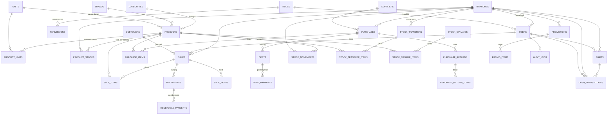

---

## 11. API Documentation

> Prefix seluruh endpoint: `/api`. Format response konsisten: `{ success, message, data, meta? }`. Semua endpoint (kecuali login/refresh/health) memerlukan header `Authorization: Bearer <token>`.

### 11.1 Auth

| Method | Endpoint | Fungsi | Request | Response |
|---|---|---|---|---|
| POST | `/auth/login` | Login | `{ username, password }` | `{ token, user }` |
| POST | `/auth/refresh` | Perbarui token | `Authorization: Bearer <token expired>` | `{ token }` |
| GET | `/auth/me` | Data user aktif | - | `user` + `permissions` |
| POST | `/auth/change-password` | Ganti password sendiri | `{ old_password, new_password }` | sukses |
| POST | `/auth/reset-password` | Reset password user (admin) | `{ user_id, new_password }` | sukses |

### 11.2 Users

| Method | Endpoint | Fungsi | Request | Response |
|---|---|---|---|---|
| GET | `/users` | Daftar user | `page, limit, search, role_id, branch_id` | list + meta |
| GET | `/users/roles` | Daftar role | - | list role |
| POST | `/users` | Buat user | `{ username, full_name, role_id, branch_id?, email?, phone?, password? }` | `{ id }` |
| PUT | `/users/:id` | Update user | `{ full_name?, role_id?, branch_id?, email?, phone?, is_active? }` | sukses |
| DELETE | `/users/:id` | Hapus user | - | sukses |
| GET | `/users/:id/permissions` | Permission per role | - | list permission |
| PUT | `/users/:id/permissions` | Update permission | `{ permissions: [{menu, can_view, can_create, can_edit, can_delete}] }` | sukses |

### 11.3 Branches & Master

| Method | Endpoint | Fungsi | Request | Response |
|---|---|---|---|---|
| GET/POST | `/branches`, `/branches/:id` | CRUD cabang | `{ name, address?, pic_name?, phone?, is_active? }` | list/detail |
| PUT/DELETE | `/branches/:id` | Update/hapus cabang | - | sukses |
| GET | `/branches/options` | Opsi dropdown | - | list aktif |
| GET/POST | `/categories`, `/brands`, `/units` | CRUD master | `{ name, ... }` | list |
| PUT/DELETE | `/categories/:id`, dst. | Update/hapus master | - | sukses |
| GET | `/{key}/options` | Opsi dropdown master | - | list aktif |

### 11.4 Products

| Method | Endpoint | Fungsi | Request | Response |
|---|---|---|---|---|
| GET | `/products` | Daftar produk | `search, category_id, brand_id, branch_id, low_stock, status, page, limit` | list + meta |
| GET | `/products/options` | Opsi untuk POS | `branch_id` | produk + units + **variants** + stok |
| GET | `/products/:id` | Detail produk | - | produk + units + stok per cabang + **variants** |
| POST | `/products` | Buat produk (multipart) | form-data: `name, base_unit_id, harga*, units (JSON string), has_expiry, has_variants, variants (JSON string), photo` | `{ id, code }` |
| PUT | `/products/:id` | Update produk | form-data/json | sukses |
| DELETE | `/products/:id` | Nonaktifkan produk (soft) | - | sukses |
| POST | `/products/generate-barcode` | Generate barcode | `{ product_id, unit_id?, format: 'EAN13'\|'CODE128' }` | `{ barcode }` |
| POST | `/products/:id/adjust-stock` | Penyesuaian stok manual | `{ branch_id, qty, note }` | sukses |

### 11.5 Suppliers & Customers

| Method | Endpoint | Fungsi | Request | Response |
|---|---|---|---|---|
| GET/POST | `/suppliers` | CRUD supplier | `{ code?, name, phone?, email?, address? }` | list |
| PUT/DELETE | `/suppliers/:id` | Update/hapus | - | sukses |
| GET | `/suppliers/:id/debts` | Hutang supplier | `status?` | list |
| GET | `/suppliers/:id/purchases` | Riwayat pembelian | - | list |
| GET/POST | `/customers` | CRUD customer | `{ code?, name, type?, phone?, email?, address? }` | list |
| PUT/DELETE | `/customers/:id` | Update/hapus | - | sukses |
| GET | `/customers/:id/receivables` | Piutang customer | - | list |
| GET | `/customers/:id/sales` | Riwayat penjualan | - | list |

### 11.6 Sales (POS)

| Method | Endpoint | Fungsi | Request | Response |
|---|---|---|---|---|
| POST | `/sales` | Proses transaksi | `{ items: [{product_id, unit_id?, qty, price?, discount?, batch_no?, expiry_date?, variant_id?, name?}], customer_id?, payment_method, total_paid?, due_date?, tax_rate?, trans_discount?, note?, branch_id? }` | `{ id, invoice_no, total, debt_amount, applied }` |
| GET | `/sales` | Daftar penjualan | `from, to, branch_id, user_id, customer_id, payment_method, search, status, page, limit` | list + meta + summary |
| GET | `/sales/:id` | Detail transaksi | - | transaksi + items + receivables |
| POST | `/sales/:id/void` | Batalkan transaksi | - | sukses (stok dikembalikan) |
| POST | `/sales/hold` | Simpan hold | `{ items, customer_id?, note, subtotal, discount_total, tax, total }` | `{ id, hold_no }` |
| GET | `/sales/holds` | Daftar hold | - | list |
| GET | `/sales/holds/:id` | Detail hold | - | detail |
| DELETE | `/sales/holds/:id` | Hapus hold | - | sukses |
| POST | `/sales/receivables/:id/pay` | Bayar piutang | `{ amount, method?, note? }` | sukses |

### 11.7 Purchases

| Method | Endpoint | Fungsi | Request | Response |
|---|---|---|---|---|
| POST | `/purchases` | Buat pembelian | `{ supplier_id, items: [{product_id, qty, batch_no?, expiry_date?}], discount_total?, tax_rate?, shipping_cost?, payment_method, total_paid?, due_date?, note?, branch_id? }` | `{ id, purchase_no, total, debt_amount }` |
| GET | `/purchases` | Daftar pembelian | `from, to, branch_id, supplier_id, payment_method, search, page, limit` | list + meta |
| GET | `/purchases/:id` | Detail pembelian | - | + items, debts, returns |
| POST | `/purchases/returns` | Retur pembelian | `{ purchase_id, items: [{product_id, qty}], return_type?, reason? }` | sukses |
| GET | `/purchases/returns` | Daftar retur | `page, limit, status` | list |

### 11.8 Stock

| Method | Endpoint | Fungsi | Request | Response |
|---|---|---|---|---|
| GET | `/stock/movements` | Mutasi stok | `product_id, branch_id, type, from, to, page, limit` | list + meta |
| GET | `/stock/card` | Kartu stok | `product_id (wajib), branch_id, from, to` | `{ product, branch, opening, items (dengan balance) }` |
| GET | `/stock/low` | Stok menipis | `branch_id?` | list |
| GET | `/batches` | Daftar batch | `branch_id, product_id, status (active/expired/expiring), days (default 30), page, limit` | list + meta (dengan `days_left`) |
| GET | `/batches/summary` | Ringkasan expired/expiring | `branch_id?` | `{ expired: {qty,total}, expiring: {qty,total} }` |
| POST | `/batches` | Input batch / stok masuk | `{ product_id, batch_no, expiry_date?, qty, note?, branch_id? }` | `{ id }` (stok bertambah) |
| PUT | `/batches/:id` | Ubah batch | `{ expiry_date?, batch_no? }` | sukses |
| POST | `/stock/transfers` | Buat transfer | `{ to_branch_id, items: [{product_id, qty}], note? }` | `{ id, transfer_no }` |
| GET | `/stock/transfers` | Daftar transfer | `status, branch_id, page, limit` | list + meta |
| GET | `/stock/transfers/:id` | Detail transfer | - | + items |
| POST | `/stock/transfers/:id/approve` | Approve transfer | - | sukses (mutasi stok) |
| POST | `/stock/transfers/:id/reject` | Reject transfer | - | sukses |
| POST | `/stock/opnames` | Buat sesi opname | `{ note? }` | `{ id, opname_no, item_count }` |
| GET | `/stock/opnames` | Daftar opname | `status, page, limit` | list + meta |
| GET | `/stock/opnames/:id` | Detail opname | - | + items |
| POST | `/stock/opnames/:id/items` | Tambah item | `{ product_id }` | item |
| PUT | `/stock/opnames/:id/items/:itemId` | Input stok fisik | `{ physical_qty }` | `{ diff_qty }` |
| POST | `/stock/opnames/:id/submit` | Submit sesi | - | sukses |
| POST | `/stock/opnames/:id/approve` | Approve (jurnal selisih) | - | sukses |
| POST | `/stock/opnames/:id/reject` | Reject | - | sukses |

### 11.9 Cash & Shift

| Method | Endpoint | Fungsi | Request | Response |
|---|---|---|---|---|
| POST | `/cash/shifts/open` | Buka shift | `{ opening_cash?, note? }` | `{ id }` |
| POST | `/cash/shifts/:id/close` | Tutup shift | `{ physical_cash, note? }` | `{ expected_cash, physical_cash, difference }` |
| GET | `/cash/shifts` | Daftar shift | `status, from, to, page, limit` | list + meta |
| GET | `/cash/shifts/current` | Shift terbuka user | - | shift / null |
| POST | `/cash/transactions` | Catat kas | `{ type: in\|out\|setor\|tarik, amount, note? }` | `{ id }` |
| GET | `/cash/transactions` | Daftar transaksi kas | `type, from, to, page, limit` | list + meta + summary (total_in/out/balance) |

### 11.10 Promotions

| Method | Endpoint | Fungsi | Request | Response |
|---|---|---|---|---|
| GET | `/promotions` | Daftar promo | `search, is_active, branch_id, page, limit` | list + meta |
| GET | `/promotions/:id` | Detail promo | - | + items |
| POST | `/promotions` | Buat promo | `{ name, type, buy_qty?, free_qty?, discount_percent?, target, branch_id?, start_date, end_date, is_active?, items? }` | `{ id }` |
| PUT | `/promotions/:id` | Update promo | partial | sukses |
| DELETE | `/promotions/:id` | Nonaktifkan | - | sukses |

### 11.11 Reports

| Method | Endpoint | Fungsi | Request | Response |
|---|---|---|---|---|
| GET | `/reports/dashboard` | Data dashboard | `branch_id?` | today, hutang, piutang, low_stock, cabang_aktif, last7, last12, top_products, top_branches |
| GET | `/reports/sales` | Laporan penjualan | `period, from, to, breakdown (cashier/branch/product/category/customer/type/method), branch_id?` | `{ summary, rows, range }` |
| GET | `/reports/purchases` | Laporan pembelian | `period, breakdown (supplier/product/branch)` | `{ summary, rows, range }` |
| GET | `/reports/cash` | Laporan kas | `period, from, to` | rows + summary |
| GET | `/reports/stock` | Laporan stok | `view: current` | rows |
| GET | `/reports/debts` | Hutang & piutang | `period, view (hutang/piutang)` | rows + umur |
| GET | `/reports/monthly` | Bulanan/tahunan | `year` | rows per bulan |
| GET | `/export/report` | Export laporan | `type (sales/purchases/cash/stock/debts), format (xlsx/pdf), period/from/to, breakdown?` | file biner (Excel/PDF) |
| GET | `/export/invoice/:saleId` | Invoice PDF | path `saleId` | file PDF |

### 11.12 Barcode

| Method | Endpoint | Fungsi | Request | Response |
|---|---|---|---|---|
| GET | `/barcode/labels` | Data label | `product_ids=1,2,3&with_units=1` | produk + labels |
| GET | `/barcode/scan/:code` | Cari produk via barcode | path `code` | produk + unit + stok; **prioritas: barcode varian → barcode satuan → barcode produk** (jika varian: `is_variant: true, variant_name, price` sudah termasuk selisih) |

### 11.13 Backup Database

| Method | Endpoint | Fungsi | Request | Response |
|---|---|---|---|---|
| GET | `/backup/files` | Daftar file backup | - | `{ files: [{ filename, size, size_label, created_at }] }` (urut terbaru) |
| GET | `/backup/info` | Info database | - | `{ database, size_mb, tables, backup_count, backup_dir }` |
| POST | `/backup` | Buat backup baru | - | `{ filename, size, size_label, created_at }` (file `lunapos-backup-YYYYMMDDHHMMSS.sql`) |
| GET | `/backup/download/:filename` | Unduh file backup | path `filename` | file `.sql` (download) |
| POST | `/backup/restore` | Restore database | `{ filename }` — **khusus Super Admin** | `{ message }` |
| DELETE | `/backup/:filename` | Hapus file backup | path `filename` | `{ message }` |

---

## 12. Business Rules

| # | Aturan | Implementasi |
|---|---|---|
| 1 | **Stok disimpan dalam satuan dasar** | `product_stocks.qty` dan `stock_movements.qty` selalu satuan dasar; konversi via `product_units.conversion_factor` |
| 2 | **Stok tidak boleh minus** | `checkStock()` melempar `INSUFFICIENT_STOCK` sebelum insert sale/approve transfer |
| 3 | **Mutasi stok selalu 2 sisi** | `applyStockMovement()` insert ke `stock_movements` + update `product_stocks` dalam satu transaksi |
| 4 | **Promo BOGO otomatis** | Item gratis ditambahkan otomatis (`is_free=1`, qty tidak mengurangi stok, harga 0); minimal `buy_qty` untuk tiap kelipatan |
| 5 | **Diskon % promo hanya untuk item match** | Target promo: produk/kategori/semua; `targetMatches()` memfilter |
| 6 | **Harga hanya bisa diedit kasir bila punya permission** | `can(req,'sales','edit')` menentukan apakah `price`/`discount` dari request dipakai; jika tidak, harga diambil dari `product_units.price` |
| 7 | **Penjualan hutang wajib customer + jatuh tempo** | Backend: `payment_method=debt/mixed` harus punya `customer_id`; frontend juga memvalidasi `due_date` |
| 8 | **Void membatalkan piutang** | `receivables` di-set `paid` + `paid_amount = amount` saat sale di-void |
| 9 | **Retur pembelian tidak boleh melebihi qty** | `qty = min(request, max qty item purchase)` |
| 10 | **Transfer antar cabang butuh approval** | Status: `pending → approved/rejected`; approve memindahkan stok, reject tidak |
| 11 | **Opname butuh workflow** | Status: `open → submitted → approved/rejected`; input fisik hanya saat `open`; approve menjurnal selisih |
| 12 | **Satu shift terbuka per user per cabang** | `openShift` menolak jika masih ada shift open |
| 13 | **Tutup shift menghitung selisih** | `expected_cash` dihitung dari kumulatif tipe transaksi kas; `difference = physical - expected` |
| 14 | **Nomor dokumen berurutan per hari** | `generateNo()` format `PREFIX-YYYYMMDD-0001`, contoh `INV-20260805-0001` |
| 15 | **Soft delete untuk master** | `is_active=0` pada produk/master/supplier/customer/promo, bukan DELETE fisik |
| 16 | **Audit log wajib** | Setiap aksi penting (login, create, update, void, approve, dll) dicatat ke `audit_logs` |
| 17 | **Permission per menu (view/create/edit/delete)** | Middleware `requirePerm()` + helper `can()`; Super Admin selalu lolos |
| 18 | **Hutang/piutang berstatus** | `unpaid → partial → paid` berdasarkan pembayaran |
| 19 | **Stok menipis** | `product_stocks.qty <= min_stock` |
| 20 | **Pembayaran hutang via penjualan (debt)** | Total tagihan = subtotal - diskon + pajak; `debt_amount = max(0, total - total_paid)` |
| 21 | **FEFO saat penjualan** | Batch dikurangi urutan: `expiry_date NULL` terakhir → `expiry_date ASC` → `id ASC`; dicatat di `audit_logs` (type `fefo_sale`) |
| 22 | **Batch unik per produk+cabang** | `UNIQUE(product_id, branch_id, batch_no)`; input batch yang sama menambah qty (upsert) |
| 23 | **Scan barcode prioritas varian** | Barcode varian dicek dulu, lalu barcode satuan, lalu barcode produk; harga varian = harga dasar + `price_adjust` |
| 24 | **Transaksi offline masuk antrian** | Saat offline, `POST /sales` disimpan ke `localStorage` (`lunapos-queue`) dan dikirim berurutan saat online (`flushQueue`) |
| 25 | **Backup via mysqldump** | `POST /backup` menjalankan `mysqldump --single-transaction --routines --triggers` → file `lunapos-backup-YYYYMMDDHHMMSS.sql` di `backend/backups/`; nama file di-sanitasi `path.basename` saat download/hapus/restore |
| 26 | **Restore hanya Super Admin** | `POST /backup/restore` menolak (403) jika `req.user.isSuperAdmin` false; restore menjalankan `mysql` CLI dengan isi file sebagai input |
| 27 | **Permission menu `backup`** | Role 1 & 2 full (view/create/edit/delete), role 3 hanya view; kasir/gudang tidak punya akses (menu tersembunyi + 403) |

---

## 13. Validasi

### 13.1 Frontend (Zod + React Hook Form)

| Field | Aturan | Halaman |
|---|---|---|
| username | wajib | Login |
| password | wajib (login), min 6 karakter (ganti/reset) | Login, Profile |
| Nama produk | wajib | Produk |
| Satuan dasar | wajib, `min(1)` | Produk |
| Harga | `min(0)`; diskon default `0..100` | Produk |
| Keranjang | minimal 1 item | POS |
| Customer hutang | wajib + jatuh tempo wajib | POS (PaymentModal) |
| Uang diterima | `>= total` (non-hutang) | POS |

### 13.2 Backend (Zod schema)

| Schema | Aturan utama |
|---|---|
| `saleSchema` | items min 1; `qty > 0`; `price >= 0`; `payment_method` enum; `tax_rate 0..100`; `total_paid >= 0` |
| `purchaseSchema` | supplier_id wajib; items min 1; `discount_total >= 0`; `tax_rate 0..100`; `shipping_cost >= 0` |
| `productSchema` | `name` wajib; `base_unit_id` wajib; harga `>= 0`; `conversion_factor > 0`; unit `is_base` valid; `variants[].name` wajib (jika ada) |
| `batchSchema` | `product_id` wajib; `batch_no` wajib; `qty > 0` (coerce number agar menerima string form) |
| `promoSchema` | `name` wajib; `type` enum bogo/discount; `buy_qty/free_qty` int min 1; `discount_percent 0..100`; `start_date/end_date` wajib |
| Master controller | `name` wajib untuk create |

### 13.3 Validasi Lainnya

| Tipe | Detail |
|---|---|
| Upload | Ekstensi JPG/JPEG/PNG/WEBP; max 2MB (Multer) |
| Pagination | `page >= 1`, `limit` dibatasi `1..100` |
| Konversi satuan | `conversion_factor > 0` (validasi Zod) |
| Barcode EAN-13 | Digit check dihitung (algoritma check digit) |
| Input fisik opname | `physical_qty` wajib, hanya saat sesi `open` |

---

## 14. Error Handling

| Aspek | Implementasi |
|---|---|
| Error API global | `errorHandler` di `middleware/errorHandler.js`: menangkap `INSUFFICIENT_STOCK`, `ER_DUP_ENTRY` (duplikat), `ER_NO_REFERENCED_ROW_2`/`ER_ROW_IS_REFERENCED_2` (relasi terpakai), `MulterError` (upload), JSON parse error |
| 404 route | `notFound()` → `{ success:false, message: 'Route ... tidak ditemukan' }` |
| Async error | `asyncHandler()` membungkus controller agar error masuk ke error handler |
| Transaksi DB | `beginTransaction` / `rollback` / `commit` di semua operasi multi-tabel (sales, purchases, transfer, opname, retur) |
| Error UI | `errMsg()` mengambil pesan bersih dari response error; toast SweetAlert2 menampilkan pesan |
| Logging | `console.error('[ERROR]', err)` di error handler; `morgan('dev')` untuk log request |
| 401 handling | Interceptor axios otomatis `logout()` + redirect ke `/` saat status 401 |
| Toast | `utils/toast.js`: success/error/info/warning dengan timer (2.2–3 detik), pause saat hover |
| Konfirmasi sebelum aksi destruktif | `swalConfirm()` dipakai untuk void, hapus, approve, reject |
| Retry | Tidak ada mekanisme retry otomatis; timeout axios 30 detik |

---

## 15. Security

| Aspek | Status | Keterangan |
|---|---|---|
| Authentication | ✅ | JWT (12 jam default, `JWT_EXPIRES_IN`), token di header `Authorization: Bearer` |
| Authorization | ✅ | RBAC per menu (view/create/edit/delete); `requirePerm()` middleware; Super Admin bypass |
| Session | ⚠️ | Token disimpan di `localStorage` (persist Zustand) → rentan XSS; tidak ada refresh token terpisah, `POST /auth/refresh` menerima token yang sama dengan `ignoreExpiration` |
| Password Hash | ✅ | `bcryptjs` salt 10 |
| CSRF | ✅ (tidak relevan) | API stateless JWT; CORS terbatas | 
| XSS | ⚠️ | React escape default; namun token di localStorage + `dangerouslySetInnerHTML` perlu diaudit |
| SQL Injection | ✅ | Semua query memakai parameterized queries (`?` placeholders) |
| CORS | ⚠️ | `cors({ origin: true, credentials: true })` → mengizinkan semua origin (refleksi); untuk produksi sebaiknya whitelist |
| Rate Limiting | ✅ | `express-rate-limit`: 1000 request / 15 menit per IP pada `/api` |
| Input Sanitization | ⚠️ | Validasi Zod + parameterized queries; belum ada sanitasi HTML di field teks |
| Helmet | ✅ | Header keamanan (CSP, X-Frame-Options, dll) dengan `crossOriginResourcePolicy: cross-origin` |
| Upload | ✅ | Batas ukuran 2MB, whitelist ekstensi, nama file random |
| Eksposur JWT Secret | ⚠️ | `JWT_SECRET` dari env; pastikan tidak masuk git |
| Validasi cabang | ⚠️ | Filter cabang di query memakai `req.user.branch_id` untuk role di bawah pusat, tetapi `branch_id` dari body request masih diterima (mis. `sales.create`) → perlu audit agar user tidak bisa mencatat transaksi ke cabang lain |

> **Asumsi:** beberapa hal di atas (refresh token, CORS whitelist) belum diimplementasikan di kode yang dibaca; rekomendasi dituangkan pada bagian 19.

---

## 16. Performance

| Aspek | Status | Keterangan |
|---|---|---|
| Caching | ❌ | Tidak ada cache Redis/memori; setiap request query DB |
| Lazy Loading | ✅ | `html5-qrcode` di-import dinamis (`await import`) hanya saat scanner dibuka |
| Pagination | ✅ | Server-side pagination (`page`/`limit`, maks 100) di hampir semua list |
| Compression | ✅ | `compression()` gzip aktif di semua response |
| Bundling | ✅ | Vite production build (code splitting otomatis, tree-shaking) |
| Minify | ✅ | Vite minify default (esbuild) |
| Database Query | ⚠️ | Query mayoritas efisien (index + join); beberapa subquery pada opname/card menggunakan `IFNULL` + subquery bisa dioptimasi; `report dashboard` menjalankan ~8 query terpisah |
| N+1 | ⚠️ | Beberapa loop `INSERT` per item (sale/purchase) dalam transaksi; jumlah item biasanya kecil |
| Timeout | ✅ | Axios timeout 30 detik |
| Pool koneksi | ✅ | `mysql2` pool 10 koneksi |

---

## 17. Kelebihan Sistem

1. **Fitur POS lengkap**: scan barcode (keyboard + kamera), hold/recall, void, shortcut keyboard, struk thermal 58/80mm.
2. **Promo engine otomatis**: BOGO & diskon % dieksekusi server-side, item FREE masuk keranjang otomatis.
3. **Multi-cabang dengan data terpusat**: stok per cabang, transfer dengan approval, dashboard pusat.
4. **Satuan bertingkat**: konversi pcs/lusin/dus otomatis, stok selalu dalam satuan dasar.
5. **Hutang/piutang terkelola**: jatuh tempo, bayar sebagian, riwayat, umur hutang/piutang di laporan.
6. **Kartu stok saldo berjalan**: transparansi mutasi per produk per cabang.
7. **RBAC granular**: 5 role × 20 menu × 4 aksi, dikelola lewat UI.
8. **Audit log**: jejak aksi user untuk accountability.
9. **Kas & shift**: selisih kas terdeteksi saat tutup shift.
10. **Laporan kaya**: 6 jenis laporan + breakdown + export CSV.
11. **Kualitas kode**: parameterized queries, transaksi DB atomik, Zod validasi, error handler global, pola controller/service/helper konsisten.
12. **Dark mode & UI modern**: Tailwind dengan tema gelap, responsif.

---

## 18. Kekurangan Sistem

1. **Token di localStorage**: rentan XSS; tidak ada refresh token terpisah.
2. **CORS terbuka** (`origin: true`): perlu whitelist di produksi.
3. **No caching & rate limit rendah per IP** (1000/15 menit bisa tercapai di POS sibuk).
4. **Validasi cabang di body**: user dengan permission bisa memaksa `branch_id` lain pada `POST /sales` dan `POST /purchases`.
5. **Tidak ada validasi `end_date >= start_date`** pada promo.
6. **Perhitungan laba estimasi**: laba = (harga jual - harga beli) × qty, tidak memperhitungkan biaya operasional, diskon nota, pajak, ongkir secara penuh.
7. **Pembayaran `debt` dengan `total_paid` lunas** tidak divalidasi secara tegas (ada blok kosong dengan komentar).
8. **Retur penjualan (sale return) tidak ada** — hanya retur pembelian.
9. **Tidak ada integrasi printer thermal langsung** dari browser (struk dicetak via print browser).
10. **Audit log mencatat user_id tapi tidak ada retensi/rotasi**; tabel bisa membesar.
11. **Tidak ada test otomatis frontend**; hanya smoke test backend.
12. **Tidak ada notifikasi** (email/WhatsApp) untuk hutang jatuh tempo, stok menipis, atau approval menunggu.
13. **Bahasa campuran** pada UI dan error message (Indonesia/Inggris) di beberapa titik.
14. **`/sales/receivables/:id/pay` GET** didefinisikan tapi di-set 405 (fine, hanya anti salah method).
15. **Kode duplikasi** antara controller sales/purchases (load produk, unit, perhitungan) bisa difaktorkan.

---

## 19. Rekomendasi Improvement

### UI/UX
- Tambahkan mode **offline/low-connection** untuk POS (antrian lokal lalu sync).
- **Dark mode** konsisten di seluruh komponen (modal, dropdown, toast sudah ditangani sebagian).
- Tambahkan **aksesibilitas**: label aria, fokus keyboard, kontras warna pada status badge.
- Buat **struk preview** sebelum cetak dan pilihan printer.
- Tambahkan **shortcut keyboard** yang didokumentasikan di UI (F2, F4, F5, F6, F9, F12).
- Tampilkan **notifikasi badge** stok menipis & approval menunggu di sidebar/header.

### Performance
- Implementasikan **Redis cache** untuk `products/options` dan laporan dashboard (TTL pendek).
- **Index** tambahan untuk `sales.created_at`, `stock_movements(ref_type, ref_id)` pada query void.
- Gabungkan query dashboard menjadi **satu agregasi** atau pakai materialized summary harian.
- Batch insert items (`INSERT ... VALUES (...), (...)`).

### Security
- Pindahkan token ke **httpOnly cookie** (atau gunakan refresh token + access token pendek).
- **Whitelist CORS** dengan env `CLIENT_URL`.
- Validasi **cabang dari token**, bukan body: `branch_id` hanya dari `req.user.branch_id` kecuali role pusat.
- Tambahkan validasi `end_date >= start_date` pada promo.
- Sanitasi input teks (XSS) dan batasi `express.json` body.
- **JWT rotation**: gunakan `kid`/secret versioning; pastikan `JWT_SECRET` kuat.
- Rate limit lebih ketat pada `/auth/login` (mis. 10/15 menit) untuk mencegah brute force.

### Code Quality & Maintainability
- Pisahkan logika bisnis ke **service layer** (sales/purchases/stock) daripada controller.
- Gunakan **repository pattern** untuk akses data.
- Buat **migration database** terstruktur (bukan satu schema.sql) untuk evolusi skema.
- Tambahkan **ESLint + Prettier** di kedua package.
- Satu format pesan error konsisten (semua Indonesia).

### Scalability
- Siapkan **worker/job queue** untuk laporan berat & export.
- **Sharding/per-cabang DB** opsional bila data tumbuh besar.
- Statistik harian (omzet, laba) di-materialisasi ke tabel `daily_summaries` untuk laporan cepat.

### Accessibility
- Semua tombol ikon diberi `aria-label`/`title`.
- Navigasi keyboard penuh pada POS & DataTable.
- Kontras warna badge status (contoh: danger di dark mode).

### SEO
- Aplikasi internal (login-protected) → SEO tidak relevan; pastikan **title & meta** per halaman untuk keperluan internal/penanda.

---

## 20. Dokumentasi Source Code

### 20.1 Backend

| File | Fungsi |
|---|---|
| `src/index.js` | Bootstrap Express: middleware global (helmet, cors, compression, json, morgan, rate limit), static uploads, route `/api`, 404 & error handler |
| `src/config/db.js` | Pool MySQL (`mysql2/promise`), `dateStrings: true`, DECIMAL dikembalikan string |
| `src/routes/index.js` | Registrasi ~70 endpoint; tiap route dilindungi `auth` + `requirePerm(menu, aksi)` |
| `src/middleware/auth.js` | Verifikasi JWT, muat user + permission, `isSuperAdmin`, `requirePerm()`, helper `can()` |
| `src/middleware/errorHandler.js` | Handler error terpusat dengan mapping kode MySQL & Multer |
| `src/middleware/upload.js` | Konfigurasi Multer: folder uploads, 2MB, whitelist ekstensi |
| `src/services/promo.js` | Engine promo: `getActivePromotions()`, `applyBogo()`, `applyDiscount()`, `processPromos()` |
| `src/utils/helpers.js` | `ok/fail` response, `asyncHandler`, `paginate`, `generateNo`, `generateCode`, `audit`, `applyStockMovement`, `checkStock` |
| `src/controllers/auth.controller.js` | Login (bcrypt compare), refresh, me, change/reset password |
| `src/controllers/users.controller.js` | CRUD user + manajemen permission per role |
| `src/controllers/branches.controller.js` | CRUD cabang |
| `src/controllers/master.controller.js` | Factory CRUD generik untuk kategori/merk/satuan |
| `src/controllers/products.controller.js` | CRUD produk + satuan bertingkat + **variasi** + barcode + adjust stock |
| `src/controllers/batches.controller.js` | Batch & expired: list (filter status/days), summary, input batch (upsert + stok), update |
| `src/controllers/exports.controller.js` | Export laporan Excel/PDF (`/export/report`) + invoice PDF (`/export/invoice/:saleId`) |
| `src/services/exporter.js` | Builder XLSX (exceljs) & PDF (pdfkit) dengan header indigo |
| `src/controllers/suppliers.controller.js` | CRUD supplier + hutang & riwayat |
| `src/controllers/customers.controller.js` | CRUD customer + piutang & riwayat |
| `src/controllers/sales.controller.js` | POS: create (promo + stok + **FEFO batch** + piutang + kas), list, get, void, hold, payReceivable |
| `src/controllers/purchases.controller.js` | Pembelian (stok + **batch** + hutang + kas) + retur |
| `src/controllers/stock.controller.js` | Mutasi, kartu stok, low stock, transfer (approval), opname (workflow) |
| `src/controllers/cash.controller.js` | Buka/tutup shift (hitung selisih), transaksi kas |
| `src/controllers/promotions.controller.js` | CRUD promo + target items |
| `src/controllers/reports.controller.js` | Dashboard + 6 laporan (sales, purchases, cash, stock, debts, monthly) |
| `src/controllers/barcode.controller.js` | Data label & pencarian scan barcode |
| `src/controllers/backup.controller.js` | Backup DB: list file, buat (mysqldump), unduh, restore (mysql CLI, khusus Super Admin), hapus, info ukuran/tabel |
| `scripts/init-db.js` | Inisialisasi DB dari schema.sql + seed.sql + user demo |
| `scripts/smoke-test.js` | Test API end-to-end |

### 20.2 Frontend

| File | Fungsi |
|---|---|
| `src/main.jsx` | Entry React + providers + **PWA registerSW + sinkronisasi antrian offline** |
| `src/App.jsx` | Routing SPA + guard login + toggle dark class |
| `src/api/client.js` | Axios instance (baseURL `/api`, timeout 30s), interceptor token & 401 logout |
| `src/api/index.js` | Modul API per resource (authApi, productsApi, salesApi, stockApi, dsb.) |
| `src/stores/auth.js` | Zustand persist: token, user, login/logout, helper `can()` |
| `src/stores/ui.js` | Dark mode & sidebar collapsed |
| `src/stores/pos.js` | State keranjang POS (item, customer, diskon, total) |
| `src/utils/format.js` | Format rupiah/tanggal/qty, presets periode, export CSV, downloadBlob/downloadURL |
| `src/utils/offline.js` | Deteksi online/offline, antrian transaksi (`lunapos-queue`), `flushQueue` sinkronisasi |
| `src/utils/toast.js` | Toast SweetAlert2 |
| `src/utils/confirm.js` | Dialog konfirmasi & prompt |
| `src/components/OfflineBadge.jsx` | Badge status offline & jumlah transaksi menunggu sinkron |
| `src/components/Layout.jsx` | Layout utama (sidebar + header + main) |
| `src/components/Sidebar.jsx` | Navigasi menu berbasis permission |
| `src/components/Header.jsx` | Header + dark mode + menu user |
| `src/components/DataTable.jsx` | Tabel generik + pagination |
| `src/components/Modal.jsx` | Modal reusable |
| `src/components/Field.jsx` | Input form wrapper |
| `src/components/ProtectedRoute.jsx` | Route guard |
| `src/components/StatCard.jsx` | Kartu statistik |
| `src/components/PageHeader.jsx` | Header halaman |
| `src/components/Skeleton.jsx` | Loading placeholder |
| `src/pages/*.jsx` | 20 halaman aplikasi |
| `src/pages/BackupPage.jsx` | Halaman Backup Database: info DB, daftar file, buat/unduh/restore/hapus backup |

---

## 21. Dependency

### 21.1 Backend (`backend/package.json`)

| Dependency | Fungsi |
|---|---|
| express | Web framework |
| mysql2 | Driver MySQL (promise pool) |
| jsonwebtoken | JWT sign/verify |
| bcryptjs | Hash & compare password |
| zod | Validasi schema request |
| helmet | Header keamanan HTTP |
| cors | Middleware CORS |
| express-rate-limit | Rate limiting |
| compression | Gzip response |
| morgan | Log request |
| multer | Upload file |
| exceljs | Export Excel (.xlsx) |
| pdfkit | Export PDF (laporan & invoice) |
| dotenv | Load env |
| nodemon (dev) | Auto-restart dev |

> **Catatan Backup**: fitur backup memanggil biner `mysqldump` & `mysql` dari instalasi MySQL (default `C:\laragon\bin\mysql\mysql-8.4.3-winx64\bin`, bisa di-override via env `MYSQL_BIN`).

### 21.2 Frontend (`frontend/package.json`)

| Dependency | Fungsi |
|---|---|
| react / react-dom | UI |
| react-router-dom | Routing |
| zustand | State management |
| axios | HTTP client |
| react-hook-form | Form |
| @hookform/resolvers | Integrasi Zod resolver |
| zod | Validasi |
| vite-plugin-pwa | PWA: manifest + service worker (Workbox) |
| lucide-react | Ikon |
| @tanstack/react-table | DataTable |
| recharts | Chart |
| lucide-react | Ikon |
| react-barcode | Render barcode |
| html5-qrcode | Scan barcode kamera |
| sweetalert2 | Toast & dialog |
| vite + @vitejs/plugin-react | Build tool |
| tailwindcss + autoprefixer + postcss | Styling |
| concurrently (root) | Jalankan backend & frontend bersamaan |

---

## 22. Alur Request

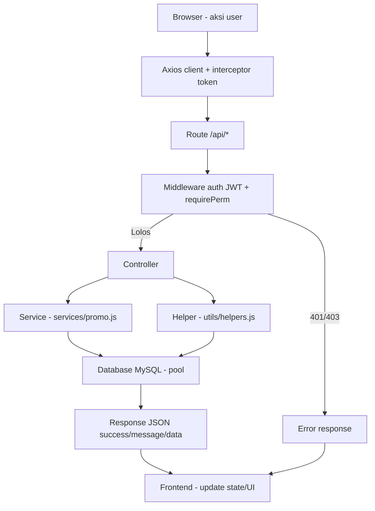

---

## 23. Sequence Diagram

### 23.1 Login

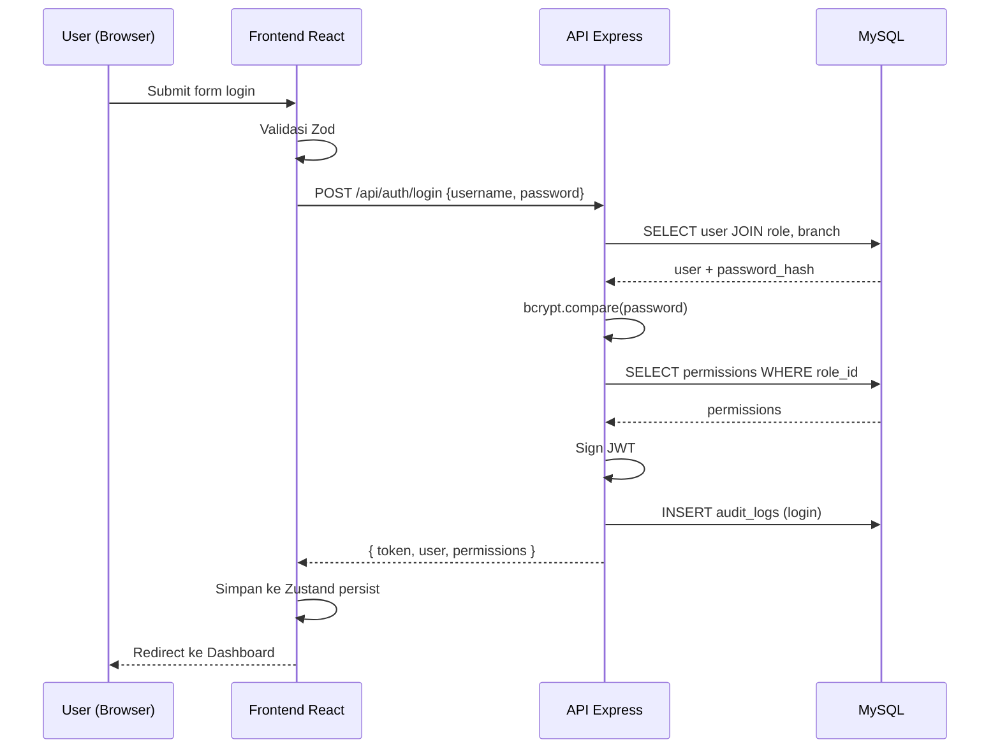

### 23.2 Transaksi POS

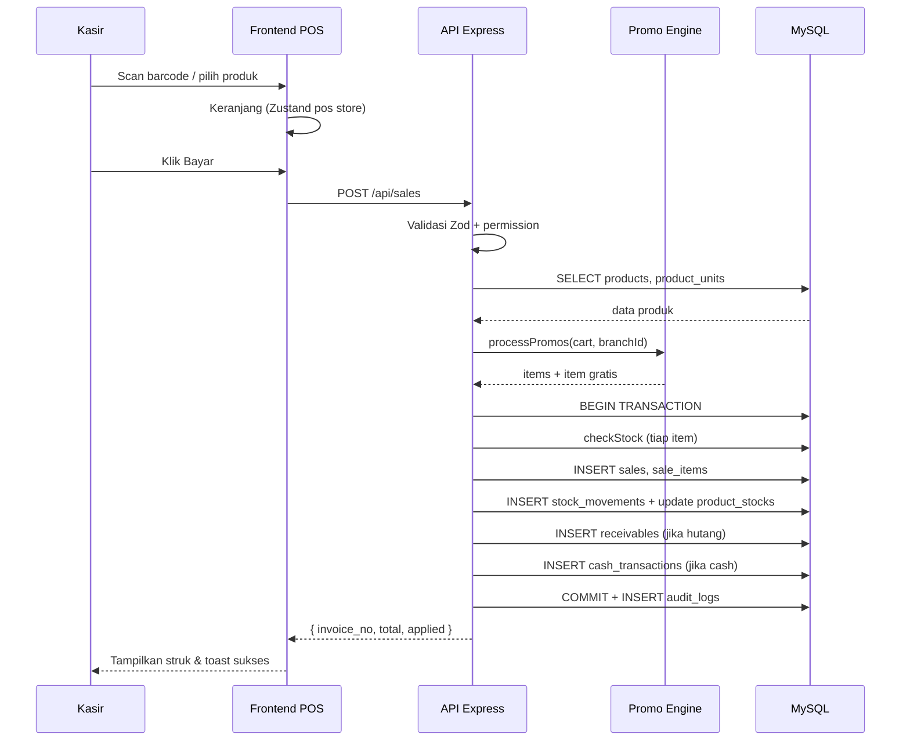

### 23.3 Approval Transfer Stok

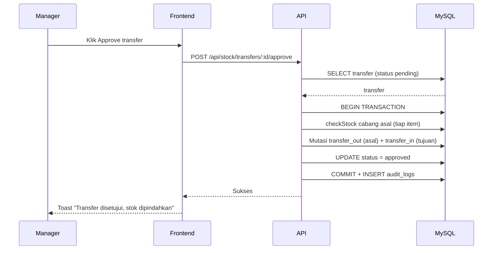

---

## 24. Activity Diagram

### 24.1 Siklus Kasir Harian

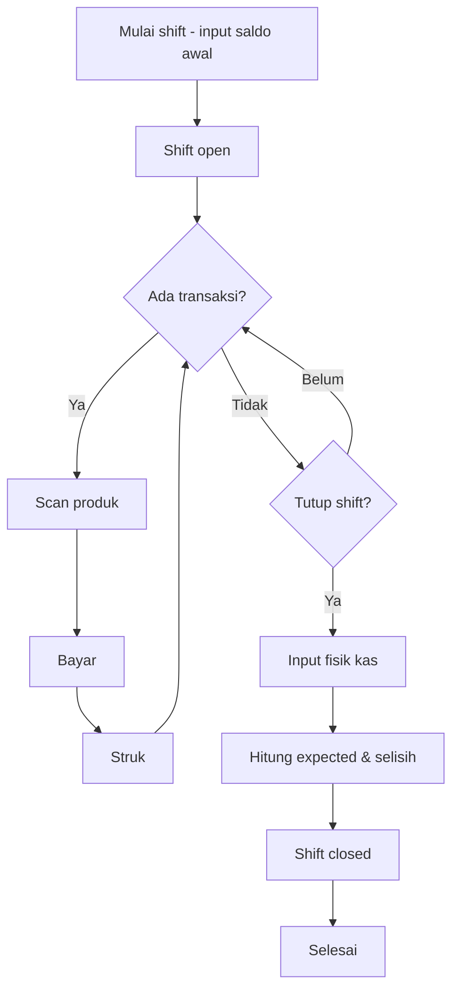

### 24.2 Stok Opname

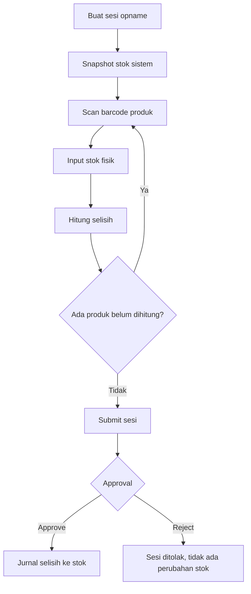

---

## 25. Use Case Diagram

```mermaid
flowchart TD
    Admin[Super Admin / Admin Pusat] --> UC1[Kelola Cabang]
    Admin --> UC2[Kelola User & Hak Akses]
    Admin --> UC3[Kelola Promo]
    Admin --> UC4[Lihat Laporan]
    Admin --> UC5[Approval Transfer & Opname]

    Manager[Manager Cabang] --> UC4
    Manager --> UC5
    Manager --> UC6[Kelola Produk & Master]
    Manager --> UC7[Kelola Supplier & Customer]

    Kasir[Kasir] --> UC8[Transaksi POS]
    Kasir --> UC9[Scan Barcode]
    Kasir --> UC10[Kelola Shift & Kas]
    Kasir --> UC11[Penjualan Hutang]

    Gudang[Gudang] --> UC6
    Gudang --> UC12[Kelola Stok & Mutasi]
    Gudang --> UC13[Stok Opname]
    Gudang --> UC14[Cetak Barcode]

    semua[Semua Role] --> UC15[Login & Ubah Password]
```

---

## 26. Class Diagram

> **Asumsi:** aplikasi tidak memakai ORM/class; diagram berikut memetakan modul backend (controller/service/helper) sebagai "class" fungsional dan relasi antar modul.

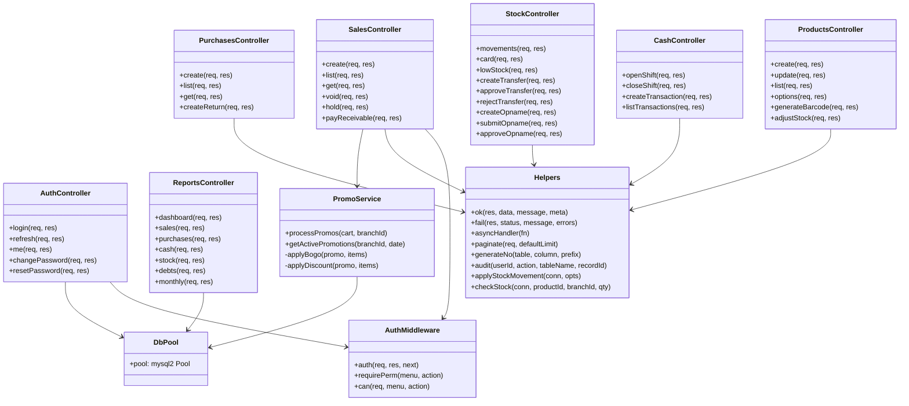

---

## 27. Kesimpulan

LunaPOS adalah sistem POS + Inventory modern berbasis **React + Vite + Tailwind CSS** (frontend), **Node.js + Express + MySQL** (backend) yang dirancang untuk ritel multi-cabang. Sistem ini menyatukan seluruh siklus bisnis toko — dari master produk dengan satuan bertingkat, transaksi kasir dengan engine promo otomatis (BOGO & diskon), pembelian dengan retur, mutasi stok antar cabang dengan approval, stok opname, kas & shift, hingga hutang/piutang dan 6 jenis laporan dengan export CSV.

Kekuatan utamanya terletak pada **integritas data**: seluruh mutasi stok tercatat sebagai jejak audit (`stock_movements`) dalam transaksi database yang atomik, semua query memakai parameterized statements, RBAC granular (5 role × 20 menu × 4 aksi), dan setiap aksi penting dicatat ke `audit_logs`. Arsitektur controller → service → helper → database pool membuat kode mudah dilacak.

Untuk produksi, sistem memerlukan penguatan pada sisi **keamanan** (token di httpOnly cookie, CORS whitelist, validasi cabang dari token), **performa** (caching laporan & opsi produk), dan **kelengkapan operasional** (retur penjualan, notifikasi jatuh tempo/approval). Dengan perbaikan tersebut, LunaPOS layak menjadi sistem POS andalan untuk usaha ritel multi-cabang skala menengah.

---

*Dokumen ini disusun berdasarkan analisis source code. Bagian yang tidak tersedia di kode ditandai sebagai **Asumsi**.*
